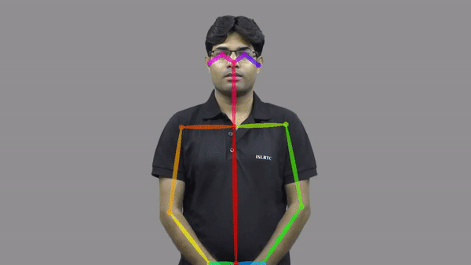

#AndroidDevChallenge 

# Sign-Companion
The task of the application is to teach and analyze the Indian Sign Language(ISL).

The focus is on below tasks -

`Letter` - Recognize the language symbols

`Word` - Formulate words from letters 

`Action` - To map a particular gesture with a certain word or activity

`Analyze` - To analyze the sign language and convert to English/Hindi  

using on-device machine learning in android application.

### Technology Stack
1. Tensorflow 2.0
2. Bazel
3. Mediapipe

### Present Models
1. Hand Track
2. Openpose

### Sample Application

