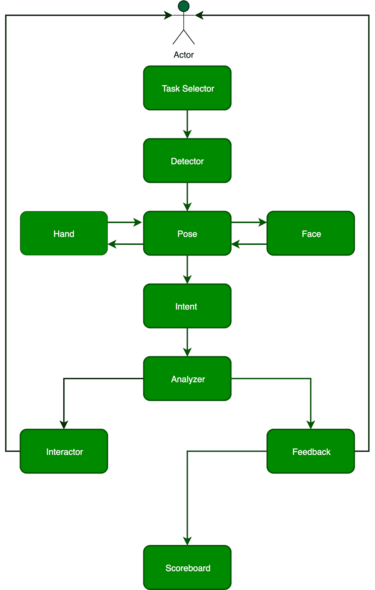

# Tech used at Leepi

Here we will talk about the technical stack used for the application from using machine learning to design choices.

## Dataset

Currently we are only focusing on Indian Sign Language as well as American Sign Language.

Below are the samples for each of them. Observe how ISL has used multiple hands for some signs. This adds a layer of additional 
work to distinguish them.

| American Sign Language      | Indian Sign Language |
| ----------- | ----------- |
|  |        |

> We will update this page for the same in future.

<!-- ### Flow for the application

 -->

